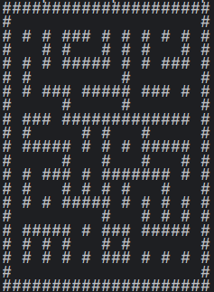
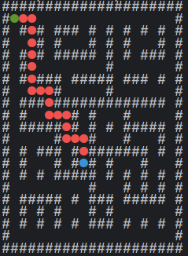

# Консольная программма "Лабиринт"

## Описание 
Консольная программы для генерации лабиринтов и поиска пути в них. Программа способна генерировать лабиринты с помощью **алгоритма Прима или Краскала** и поиска пути в них по заданным координатам с помощью **BFS или A***.

## Запуск
Из корневой директории ввести команду:
```bash
python ./src/main.py
```

## Пример лабиринта размера 21 * 21, сгенерированного с помощью алгоритма Краскала:


## И поиск пути в нем (1, 1) -> (13, 9)

## Запуск тестов
Из корневой директории ввести команду:
```bash
pytest ./tests
```